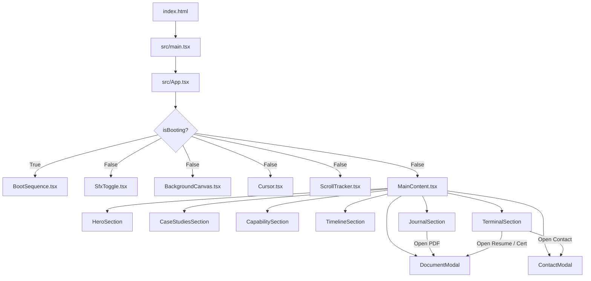

# Pavan D R — AI Engineering Workspace & Portfolio

An editorial, cinematic, and interactive digital portfolio and engineering workspace for **Pavan D R**, an AI Software Engineer & Full Stack Developer based in Bengaluru, India.

Built with **React 19**, **TypeScript**, and **Vite**, the application combines a cyberpunk/retro-futuristic command-line aesthetic, interactive 2D canvas particle networks, Web Audio API sound synthesis, dynamic SVG blueprint architecture visualizations, an emulated interactive CLI terminal, and document preview modals.

---

## 📑 Table of Contents

- [Overview & Aesthetics](#overview--aesthetics)
- [Project Architecture & Directory Structure](#project-architecture--directory-structure)
- [System Architecture & Component Flow](#system-architecture--component-flow)
- [Website Content & Sections Breakdown](#website-content--sections-breakdown)
  - [1. Boot Sequence](#1-boot-sequence)
  - [2. Hero Section](#2-hero-section)
  - [3. 01 / Architecture — Product Engineering (Projects)](#3-01--architecture--product-engineering-projects)
  - [4. 02 / Capabilities — Engineering Systems (Skills Matrix)](#4-02--capabilities--engineering-systems-skills-matrix)
  - [5. 03 / Pipeline — Commit History (Education & Qualifications)](#5-03--pipeline--commit-history-education--qualifications)
  - [6. 04 / Logs — Engineering Journal (Certifications & Publications)](#6-04--logs--engineering-journal-certifications--publications)
  - [7. 05 / Terminal — Interactive CLI & Communication Channels](#7-05--terminal--interactive-cli--communication-channels)
- [Interactive Features & Audio Engine](#interactive-features--audio-engine)
- [Git Repository & Version Control Context](#git-repository--version-control-context)
- [Tech Stack & Dependencies](#tech-stack--dependencies)
- [Getting Started & Local Development](#getting-started--local-development)

---

## 🖥️ Overview & Aesthetics

The application represents an AI software engineer's mission control dashboard and editorial portfolio. It operates under two selectable themes:
- **Matrix (Default)**: Dark cyber-green terminal ambiance (`--hue-primary: 155`).
- **Onyx**: Monochrome high-contrast obsidian editorial style.

### Key Visual & Interactive Elements:
- **Bootloader Sequence**: Simulates hardware kernel boot, virtual filesystem mounting, and neural network handshake.
- **Dynamic Particle Canvas**: Real-time canvas simulation with node networks, dynamic distance-based mesh lines, cursor magnetic push physics, and data packet routing animations.
- **Synthesized Audio Engine**: Zero-asset, pure browser Web Audio API oscillator synthesis generating custom clicks, typing feedback, and hover blips.
- **Blueprint Vector Graphics**: Inline SVG diagrams dynamically illustrating data flow pipelines for projects like RAG, LSTM cricket telemetry, and offline sync engines.
- **Interactive Terminal**: Emulated command line with command history, dossier extraction, theme switching, and live system queries.
- **Integrated PDF & Document Viewer**: Embedded modal viewer with zoom controls, download capabilities, and responsive layouts.
- **Secure Web3Forms Contact Bridge**: Background contact transmission directly to `pavandr715@gmail.com`.

---

## 📂 Project Architecture & Directory Structure

```plaintext
pav/
├── .oxlintrc.json              # Oxlint linting configuration schema
├── index.html                  # HTML entry point (fonts: Inter, JetBrains Mono, Outfit)
├── package.json                # Project dependencies and build scripts
├── tsconfig.json               # Root TypeScript configuration
├── tsconfig.app.json           # Application TypeScript configuration
├── tsconfig.node.json          # Vite node runtime TypeScript configuration
├── vite.config.ts              # Vite configuration with React plugin
├── public/                     # Static assets served at root
│   ├── favicon.svg             # Application favicon
│   ├── icons.svg               # SVG sprites and UI symbols
│   ├── resume.pdf              # Pavan D R official Curriculum Vitae
│   ├── research-paper.pdf      # IJARCCE published research paper
│   ├── publication-certificate.pdf # IJARCCE publication certificate
│   ├── ibm-skillsbuild-certificate.pdf # IBM SkillsBuild GLE completion certificate
│   └── infosys-ml-certificate.pdf # Infosys Springboard Machine Learning certificate
└── src/                        # Main application source code
    ├── main.tsx                # React DOM root bootstrapping
    ├── App.tsx                 # Root layout, bootloader gate, parallax, SFX listener
    ├── assets/                 # Local image & SVG assets
    │   ├── hero.png            # Hero section graphics
    │   ├── react.svg           # React framework logo
    │   └── vite.svg            # Vite logo
    ├── components/             # Reusable UI widgets and system overlays
    │   ├── BackgroundCanvas.tsx # Animated HTML5 canvas node & packet grid
    │   ├── BootSequence.tsx    # Terminal startup simulation screen
    │   ├── ContactModal.tsx    # Web3Forms powered modal message dialog
    │   ├── Cursor.tsx          # Custom glowing cursor with trailing dot
    │   ├── DocumentModal.tsx   # PDF / Image viewer with zoom and download
    │   ├── MainContent.tsx     # Page orchestrator tying sections together
    │   ├── ScrollTracker.tsx   # Vertical scroll progress & coordinates readout
    │   ├── SfxToggle.tsx       # Mute / Unmute switch for Web Audio sound effects
    │   └── sections/           # Modular page sections
    │       ├── HeroSection.tsx         # Hero introduction and system status
    │       ├── CaseStudiesSection.tsx  # Featured, Full Stack, and Other Projects
    │       ├── CapabilitySection.tsx   # Skill clusters and technology tree
    │       ├── TimelineSection.tsx     # Git commit style education timeline
    │       ├── JournalSection.tsx      # Publications and certifications log
    │       └── TerminalSection.tsx     # Interactive CLI shell & contact shortcuts
    ├── hooks/
    │   └── useScrollReveal.ts  # IntersectionObserver hook for viewport animations
    ├── styles/
    │   ├── main.css            # Base design system, CSS variables, typography
    │   ├── components.css      # Component cards, blueprint SVGs, layout grids
    │   ├── animations.css      # Keyframes, pulse effects, cursor blinks, fade-ups
    │   ├── BootSequence.css    # Boot sequence terminal window and progress bar
    │   ├── ContactModal.css    # Contact dialog backdrop and form styling
    │   └── DocumentModal.css   # Document preview modal with viewport iframe
    └── utils/
        └── audio.ts            # Web Audio API sound synthesis generators
```

---

## 🏗️ System Architecture & Component Flow



---

## 🌐 Website Content & Sections Breakdown

All information rendered on `http://localhost:5173/` is structured across dedicated sections:

### 1. Boot Sequence
- **Startup Animation**: Simulates a Linux/Unix style kernel initialization:
  - `INITIATING BOOT SEQUENCE...`
  - `LOADING KERNEL v9.4.2 [OK]`
  - `MOUNTING VIRTUAL FILE SYSTEM [OK]`
  - `ESTABLISHING SECURE CONNECTION...`
  - `AUTHENTICATING GUEST USER [OK]`
  - `LOADING NEURAL ARCHITECTURE...`
  - `INITIALIZING UI PROTOCOLS [OK]`
  - `SYSTEM READY.`
- Features an incremental progress bar and smooth opacity transition into the main workspace.

---

### 2. Hero Section
- **Status Indicator**: `SYSTEM.STATUS: ONLINE`
- **Editorial Headline**:
  - `ENGINEERING`
  - `INTELLIGENT`
  - `SYSTEMS`
- **Introduction**:
  > *"I am Pavan D R, an AI Software Engineer & Full Stack Developer. I design and architect scalable solutions at the intersection of machine learning models, product architecture, and human-centered engineering."*
- **System Readout**:
  - `> Loading competencies...`
  - `> Neural Architecture [OK]`
  - `> Full Stack Data Pipelines [OK]`
  - `> Product UX Rendering [OK]`
- **Calls to Action**:
  - `> Execute Case Studies_` (smooth-scrolls to Case Studies)
  - Interactive scroll wheel indicator.

---

### 3. 01 / Architecture — Product Engineering (Projects)

Displays curated software engineering case studies categorized into **Featured Projects**, **Full Stack**, and **Other Projects**, complete with interactive SVG architectural blueprints:

#### Featured Projects

1. **RAG Knowledge Assistant** *(AI Engineering • Retrieval-Augmented Generation (RAG))*
   - **Tagline**: Production-ready AI knowledge assistant with multi-provider LLM support and document-grounded conversations.
   - **Overview**: A production-ready Retrieval-Augmented Generation (RAG) application that enables users to upload documents and interact with them through AI-powered conversations. Combines semantic search, vector embeddings, and large language models to generate context-aware, document-grounded responses while supporting multiple AI providers through secure per-user API key management. Built with a clean, scalable architecture emphasizing reliability, extensibility, and an intuitive user experience.
   - **Key Highlights**:
     - Multi-document knowledge base
     - PDF, DOCX and TXT document ingestion
     - Semantic search with vector embeddings
     - Persistent ChromaDB vector database
     - Multi-provider LLM support
     - Secure per-user encrypted API key management
     - Structured AI responses with citations and metadata
     - Conversation history and persistent chat sessions
     - Clean architecture with separated application layers
     - Responsive modern interface
   - **Tech Stack**: `React`, `TypeScript`, `Vite`, `Tailwind CSS`, `FastAPI`, `Python`, `ChromaDB`, `SQLite`, `Gemini API`, `Sentence Transformers`, `Pydantic`.
   - **Visual Blueprint**: SVG pipeline: `Documents -> Document Processing -> Embedding Generation -> ChromaDB Vector Store -> Semantic Retrieval -> LLM Provider -> Structured AI Response`.
   - **Live Demo**: [rag-application-ashy.vercel.app](https://rag-application-ashy.vercel.app/)
   - **GitHub**: [github.com/pvndr/rag-application](https://github.com/pvndr/rag-application)

2. **CricShift** *(2026 // AI Analytics)*
   - **Subtitle**: Predictive Momentum Engine.
   - **Problem**: Traditional cricket analytics rely on static historical averages, failing to capture real-time momentum shifts during live play.
   - **Architecture**: Sequential deep learning pipeline (LSTMs) processing live ball-by-ball telemetry to output a real-time momentum index via sub-50ms WebSockets.
   - **Technical Decisions**: Prioritized edge-inference efficiency and sparse-data anomaly handling.
   - **Outcomes**: Highly performant real-time UI rendering without frame drops during heavy data ingestion.
   - **Tech Stack**: `Python`, `TensorFlow`, `React`, `WebSockets`.
   - **Visual Blueprint**: SVG signal pipeline showing parallel telemetry feeding into `LSTM` and `WSS` endpoints.

#### Full Stack Projects

3. **Chronicle — Personal Publishing & Reflection Platform**
   - **Overview**: An editorial journaling and publishing platform with private reflections, public essays, authentication, analytics, and a production PostgreSQL backend.
   - **Highlights**:
     - Multi-user authentication & authorization
     - Private journaling & public publishing workflows
     - Server-side search, filtering & analytics
     - Production PostgreSQL + Vercel deployment
   - **Tech Stack**: `Next.js`, `Prisma`, `PostgreSQL`, `Supabase`.
   - **Live Demo**: [chronicle-app-tau.vercel.app](https://chronicle-app-tau.vercel.app)
   - **GitHub Repository**: [github.com/pvndr/chronicle-app](https://github.com/pvndr/chronicle-app)
   - **Visual Blueprint**: SVG architecture showing Journal client routing into PostgreSQL storage and Dispatch handlers.

#### Other Projects

4. **LabPad**
   - **Overview**: An offline-first Progressive Web Application (PWA) built for engineering students to securely store and manage code snippets and notes.
   - **Features & Architecture**:
     - Offline-first architecture with instant IndexedDB and localStorage caching
     - Progressive Web App (PWA) with Service Worker and Workbox installability
     - Automatic cloud synchronization with Supabase and PostgreSQL backend
     - Intelligent timestamp-based conflict resolution
     - Real-time online/offline network detection
     - Collaborative shared room code sharing
   - **Tech Stack**: `React 18`, `Vite`, `Supabase`, `PostgreSQL`, `IndexedDB`, `Workbox`, `JavaScript`, `HTML`, `CSS`.
   - **Live Demo**: [project-d81ht.vercel.app](https://project-d81ht.vercel.app/)
   - **GitHub Repository**: [github.com/pvndr/LabPad.git](https://github.com/pvndr/LabPad.git)
   - **Visual Blueprint**: SVG schematic showing User to React Frontend to IndexedDB to Sync Engine to Supabase Cloud.

5. **Interactive Valentine's Experience**
   - **Overview**: A frontend-focused web application transforming a traditional Valentine's proposal into an engaging digital journey.
   - **Features**:
     - Mock authentication using native Web Crypto API
     - State-driven user interaction flow and scene transitions
     - Dynamic evasive "No" button with collision avoidance
     - Responsive card-based date selection
     - Smooth micro-animations and background transitions
     - Google Forms integration for response collection
     - 100% Vanilla JavaScript architecture without framework overhead
   - **Tech Stack**: `HTML5`, `CSS3`, `JavaScript`, `Bootstrap 5`, `Web Crypto API`, `Google Forms`.
   - **Live Demo**: [our-valentinestory.netlify.app](https://our-valentinestory.netlify.app/)
   - **GitHub Repository**: [github.com/pvndr/valentine-app](https://github.com/pvndr/valentine-app)

---

### 4. 02 / Capabilities — Engineering Systems (Skills Matrix)

An interactive skill network mapping core technical competencies:

| Category | Competencies & Technologies |
| :--- | :--- |
| **AI / ML** | `Python`, `Machine Learning`, `Prompt Engineering`, `LangChain`, `Pinecone`, `TensorFlow`, `RAG Architecture` |
| **Full Stack** | `HTML5`, `CSS3`, `JavaScript`, `TypeScript`, `React`, `Next.js`, `Node.js`, `MySQL`, `PostgreSQL`, `Prisma`, `Supabase`, `Git & GitHub` |
| **Engineering** | `Data Structures & Algorithms`, `Object-Oriented Programming (OOP)`, `DBMS`, `FastAPI`, `Responsive Web Design`, `Problem Solving`, `REST & WebSockets` |

---

### 5. 03 / Pipeline — Commit History (Education & Qualifications)

Structured as an interactive Git branch tree with commit hashes, commit dots, branches, and merges:

1. **`init repository` — High School Education**
   - **Timeline**: Class of 2021
   - **Institution**: Jain Vidyalaya
   - **Description**: Early academic years focusing on core subjects, building discipline, and developing a foundational curiosity for science and technology.

2. **`branch feature/science` — Science Student**
   - **Timeline**: [2021] — [2023]
   - **Institution**: Anubhava Mantapa
   - **Description**: Developed core problem-solving skills through comprehensive study of fundamental sciences, bridging the gap to applied technology.

3. **`merge branch 'bachelors/cse'` — Bachelor of Engineering [B.E] in CSE**
   - **Timeline**: [2023] — Present
   - **Institution**: K.S. School of Engineering and Management
   - **Academic Merit**: **CGPA: 8.56**
   - **Description**: Exploring core computing principles alongside emerging technologies like artificial intelligence and distributed systems.

4. **`commit HEAD` — Aspiring AI Software Engineer**
   - **Timeline**: Present
   - **Status**: `● Available for Full-Time Opportunities`
   - **Description**: Actively building AI-powered applications, Retrieval-Augmented Generation (RAG) systems, machine learning solutions, and modern full-stack web applications.

---

### 6. 04 / Logs — Engineering Journal (Certifications & Publications)

Integrated log entries with one-click PDF modal previews:

1. **Research Publication**
   - **Title**: *A Survey on Machine Learning Approach for Momentum Shift Detection and Win Prediction in Cricket Matches*
   - **Journal**: International Journal of Advanced Research in Computer and Communication Engineering (IJARCCE)
   - **Published**: May 2026
   - **DOI**: `10.17148/IJARCCE.2026.155194`
   - **Status**: `✓ PUBLISHED`
   - **Document**: [`/research-paper.pdf`](file:///c:/Users/pavan/OneDrive/Desktop/pav/public/research-paper.pdf) (Previewable via modal)

2. **Certificate of Publication — IJARCCE**
   - **Title**: Certificate of Publication - IJARCCE
   - **Issued By**: IJARCCE
   - **Date**: May 2026
   - **DOI**: `10.17148/IJARCCE.2026.155194`
   - **Status**: `✓ VERIFIED`
   - **Document**: [`/publication-certificate.pdf`](file:///c:/Users/pavan/OneDrive/Desktop/pav/public/publication-certificate.pdf)

3. **IBM SkillsBuild Hackathon-Integrated Guided Learning Experience (GLE)**
   - **Issued By**: Edunet Foundation & IBM SkillsBuild
   - **Status**: `✓ COMPLETED`
   - **Document**: [`/ibm-skillsbuild-certificate.pdf`](file:///c:/Users/pavan/OneDrive/Desktop/pav/public/ibm-skillsbuild-certificate.pdf)

4. **Explore Machine Learning using Python**
   - **Issued By**: Infosys Springboard
   - **Issued On**: April 13, 2026
   - **Status**: `✓ COMPLETED`
   - **Document**: [`/infosys-ml-certificate.pdf`](file:///c:/Users/pavan/OneDrive/Desktop/pav/public/infosys-ml-certificate.pdf)

---

### 7. 05 / Terminal — Interactive CLI & Communication Channels

The website features an interactive shell emulator (`guest@pavan:~$`) that supports user commands:

| Command | Action / Response |
| :--- | :--- |
| `help` | Lists all supported terminal commands |
| `resume` / `cv` | Extracts encrypted dossier summary and displays a `[PREVIEW_FULL_PDF]` button to view [`resume.pdf`](file:///c:/Users/pavan/OneDrive/Desktop/pav/public/resume.pdf) |
| `hire` | Displays recruitment availability status |
| `projects` | Lists all 5 core case studies |
| `skills` | Prints full languages, frameworks, databases, and AI skill matrix |
| `whoami` | Outputs name and role |
| `theme matrix` | Swaps system style to Cyber Matrix Green |
| `theme onyx` | Swaps system style to Monochrome High-Contrast Onyx |
| `contact` | Opens the secure communication modal form |
| `github` | Navigates to [https://github.com/pvndr](https://github.com/pvndr) |
| `linkedin` | Navigates to [https://www.linkedin.com/in/pavandr-ai/](https://www.linkedin.com/in/pavandr-ai/) |
| `clear` | Plays a wipe animation and clears the terminal history |
| `sudo` | Emulates security denial: `pavan is not in the sudoers file. This incident will be reported.` |

#### Contact Channels:
- **Email**: `pavandr715@gmail.com` (Includes instant one-click clipboard copy with confirmation toast)
- **Location**: Bengaluru, Karnataka, India
- **GitHub**: [github.com/pvndr](https://github.com/pvndr)
- **LinkedIn**: [linkedin.com/in/pavandr-ai](https://www.linkedin.com/in/pavandr-ai/)
- **Contact Form**: Web3Forms API endpoint transmitting inquiries directly to email with validation and sending status.

---

## 🔊 Interactive Features & Audio Engine

The application includes an internal sound synthesizer implemented in `src/utils/audio.ts` utilizing the browser's native `AudioContext`:
- **Hover Sound**: `playHoverSound()` — 440Hz to 880Hz sine wave frequency sweep (50ms).
- **Click Sound**: `playClickSound()` — 300Hz to 150Hz triangle wave downward pitch drop (80ms).
- **Typing Sound**: `playTypingSound()` — 800Hz - 1000Hz randomized square wave chirp mimicking mechanical switch clicks (20ms).
- **Audio Toggle**: Accessible anytime via the speaker icon in the top header (`SfxToggle.tsx`).

---

## 📜 Git Repository & Version Control Context

- **Current Repository State**: Initialized git repository.
- **Commit History**:
  ```plaintext
  9046889 Initial commit before refactoring
  ```
- **Active Git Remote / GitHub**: [https://github.com/pvndr](https://github.com/pvndr)

---

## 🛠️ Tech Stack & Dependencies

### Core Technologies
- **Runtime & Framework**: [React 19](https://react.dev/) (`^19.2.8`), [React DOM](https://react.dev/) (`^19.2.8`)
- **Language**: [TypeScript](https://www.typescriptlang.org/) (`~6.0.2`)
- **Bundler & Dev Server**: [Vite](https://vitejs.dev/) (`^8.2.0`)
- **Linter**: [Oxlint](https://oxc.rs/) (`^1.75.0`)
- **Email Integration**: [Web3Forms API](https://web3forms.com/)
- **Typography**: Inter, JetBrains Mono, Outfit (via Google Fonts)

---

## 🚀 Getting Started & Local Development

### Prerequisites
- [Node.js](https://nodejs.org/) (version 18+ recommended)
- `npm` (bundled with Node.js)

### Installation
1. Clone or open the project folder:
   ```bash
   cd c:/Users/pavan/OneDrive/Desktop/pav
   ```
2. Install project dependencies:
   ```bash
   npm install
   ```

### Running Locally
To start the local development server with Hot Module Replacement (HMR):
```bash
npm run dev
```
Open your browser and navigate to:
```
http://localhost:5173/
```

### Production Build
To run type checks and compile the optimized production bundle:
```bash
npm run build
```
The compiled output will be generated in the `dist/` directory.

To preview the production build locally:
```bash
npm run preview
```

### Linting
To check code quality with Oxlint:
```bash
npm run lint
```
